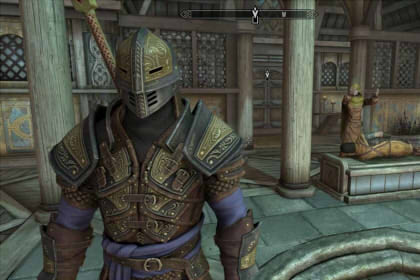
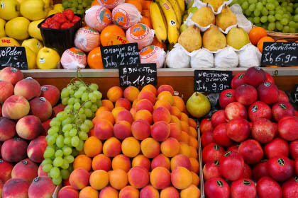
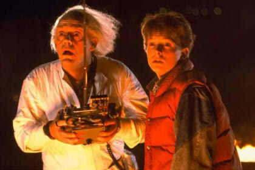

# Ejercicios de Arreglos en Python

En esta sección encontrarás ejercicios temáticos para practicar arreglos (listas) en Python.

## 1) Recompensas en One Piece


La Marina ha publicado recompensas por capturar a los piratas más peligrosos del mundo.

Dispones de dos arreglos paralelos:
- Uno con los nombres de los piratas.
- Otro con sus recompensas (en millones de berries).

```python
piratas = [
	"Monkey D. Luffy", "Roronoa Zoro", "Sanji", "Nami", "Usopp", "Nico Robin",
	"Franky", "Brook", "Jinbe",
	"Shanks", "Marshall D. Teach", "Charlotte Linlin", "Kaido", "Buggy",
	"Trafalgar D. Water Law", "Eustass Kid"
]

recompensas = [
	3000, 1200, 1100, 366, 200, 930,
	500, 383, 1100,
	4000, 3960, 4388, 4611, 3189,
	3000, 3000
]
```

Desarrolla un programa que permita:
1. **Pirata más buscado:** encontrar al pirata con la recompensa más alta y mostrar su nombre junto al valor.
2. **Piratas sobre un umbral:** pedir al usuario un umbral de recompensa (por ejemplo, 1000) y mostrar todos los piratas cuya recompensa sea mayor.
3. **Resumen de recompensas:** calcular y mostrar el total y el promedio de todas las recompensas.

---

## 2) La Leyenda de Zelda


Link, héroe de Hyrule, está reuniendo objetos para enfrentar a Ganondorf.

Reglas del juego:
- Link puede tener varios objetos en su inventario.
- Link puede equipar **máximo 4 objetos**.
- Solo puede equipar objetos que estén en su inventario.
- Al inicio, no tiene objetos.

Crea un programa con menú que permita:
1. Agregar un objeto al inventario.
2. Equipar un objeto (validando el máximo de 4 y que exista en inventario).
3. Verificar estado de combate:
   - Si tiene equipada una espada y un escudo, mostrar: **"Link está listo para pelear"**.
   - En caso contrario, mostrar: **"Aún falta para enfrentar a Ganondorf"**.
4. Ver objetos del inventario.
5. Ver objetos equipados.
6. Salir.

---

## 3) Días de Licencia


En una empresa, 7 empleados se han tomado días de licencia durante este mes:

```python
licencias = [5, 11, 3, 15, 2, 5, 6]
```

Calcula y muestra:
1. El promedio de días de licencia (con **2 decimales**).
2. El mayor número de días de licencia.
3. El menor número de días de licencia.
4. Cuántos empleados tomaron más de 10 días.

---

## 4) Torneo de Street Fighter


M. Bison, líder de Shadaloo, organiza un torneo para demostrar quién es el más fuerte.

Debes crear un programa que:
1. Permita ingresar **8 peleadores** en un arreglo.
2. Muestre los enfrentamientos según el siguiente formato:

**Cuartos de final**
- Combate 1: P1 vs P3
- Combate 2: P2 vs P4
- Combate 3: P5 vs P7
- Combate 4: P6 vs P8

En cada combate, debes registrar quién gana.

**Semifinales**
- Combate 5: ganador del combate 1 vs ganador del combate 3
- Combate 6: ganador del combate 2 vs ganador del combate 4

**Final**
- Combate 7: ganador del combate 5 vs ganador del combate 6

Al final, muestra el campeón del torneo.

---

## 5) Skyrim: Inventario Limitado



En un baúl antiguo encuentras varios objetos y decides guardarlos, pero tu inventario tiene capacidad limitada.

Objetos iniciales:
- Moneda de oro
- Manzana dulce
- Mapa mundial
- Poción recuperativa
- Libro antiguo

Regla principal:
- El inventario tiene un máximo de **5 objetos**.

Crea un programa con menú que permita:
1. Ver inventario actual.
2. Agregar un objeto (solo si no está lleno).
3. Dejar un objeto:
   - Mostrar los objetos numerados.
   - Pedir al usuario el número del objeto a eliminar.
4. Ingresar una palabra y eliminar todos los objetos que la contengan.
5. Salir.

---

## 6) Frutería



En la feria se venden frutas con sus precios por kilo.

Cada subarreglo contiene: `[nombre_fruta, precio_por_kilo]`.

```python
fruteria = [
	["Manzana", 1200],
	["Plátano", 800],
	["Naranja", 1000],
	["Sandía", 2500],
	["Uva", 1800],
	["Kiwi", 1500],
	["Pera", 1100],
	["Mango", 2200]
]
```

Desarrolla un programa que:
1. Encuentre la fruta más cara e imprima su nombre y precio.
2. Pida al usuario un umbral de precio y muestre todas las frutas que lo superen.
3. Calcule el promedio de precios por kilo.
4. Agregue la fruta **Palta** con precio **8500**.

---

## 7) Volver al Futuro



El DeLorean ha registrado viajes en el tiempo de distintos personajes.

Dispones de un arreglo de arreglos donde cada subarreglo contiene:
- Nombre del personaje.
- Lista de años a los que viajó.

```python
personajes = [
	["Dr. Emmett Brown", [1955, 2015, 1885, 2030]],
	["Marty McFly", [1955, 1985, 2015, 2034]],
	["Biff Tannen", [1955, 1985]]
]
```

Ahora resuelve:
1. **Mostrar viajes:** imprimir todos los viajes realizados por cada personaje.
2. **Filtrar por umbral:** pedir al usuario un año umbral y mostrar qué personajes viajaron a un año posterior.

