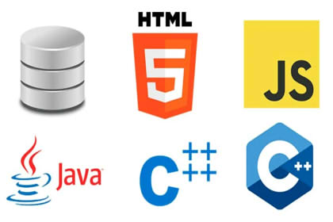

# Ejercicios de Diccionarios en Python

En esta sección encontrarás ejercicios temáticos para practicar diccionarios en Python.

---

## 1) Dragon Ball (`dragon_ball.py`)


Eres un soldado del ejército del gran Freezer, encargado de administrar el registro de combatientes potencialmente peligrosos del Universo 7.

Dispones de la siguiente lista de peleadores:

```python
peleadores = [
    {"nombre": "Gokú",    "raza": "Saiyajín",     "poder_de_pelea": 80000},
    {"nombre": "Vegeta",  "raza": "Saiyajín",     "poder_de_pelea": 60000},
    {"nombre": "Krillin", "raza": "Humano",        "poder_de_pelea": 35000},
    {"nombre": "Piccolo", "raza": "Namekusejin",   "poder_de_pelea": 70000},
    {"nombre": "Gohan",   "raza": "Mestizo",       "poder_de_pelea": 75000}
]
```

Desarrolla un programa que:
1. Muestre todos los peleadores con un poder de pelea mayor a **40.000**.
2. Muestre todos los peleadores de la raza **Saiyajín**.
3. Muestre todas las razas registradas (sin repetirlas).
4. Muestre al peleador con mayor poder de pelea.
5. Agregue al temido **Yamcha** con raza `"Humano"` y poder de pelea `8000`.

---

## 2) Lenguajes de Programación (`lenguajes.py`)



Dispones de un registro con información detallada de distintos lenguajes de programación:

```python
lenguajes = [
    {
        "nombre": "Python",
        "tipo": "interpretado",
        "creado_en": 1991,
        "creador": "Guido van Rossum",
        "descripcion": "Lenguaje fácil de aprender, con sintaxis clara y versátil",
        "popularidad": 9,
        "paradigmas": ["OOP", "funcional", "procedural"]
    },
    {
        "nombre": "Java",
        "tipo": "compilado",
        "creado_en": 1995,
        "creador": "James Gosling",
        "descripcion": "Lenguaje orientado a objetos, robusto y multiplataforma",
        "popularidad": 8,
        "paradigmas": ["OOP", "funcional"]
    },
    {
        "nombre": "C",
        "tipo": "compilado",
        "creado_en": 1972,
        "creador": "Dennis Ritchie",
        "descripcion": "Lenguaje de bajo nivel, base de muchos sistemas operativos",
        "popularidad": 7,
        "paradigmas": ["procedural"]
    }
]
```

Desarrolla un programa que:
1. Agregue **JavaScript** con tipo `"interpretado"`, creado en `1995`, creador `"Brendan Eich"`, descripción `"Lenguaje fácil de aprender para el desarrollo web"`, popularidad `9` y paradigmas `["OOP", "funcional"]`.
2. Muestre todos los lenguajes de tipo `"interpretado"`.
3. Calcule el promedio de popularidad de todos los lenguajes.
4. Muestre todos los lenguajes creados después del año `1990`.
5. Busque todos los lenguajes que tengan la palabra `"fácil"` en su descripción.

---

## 3) Ecommerce (`ecommerce.py`)


Luis está comprando componentes tecnológicos en una tienda online. Su carrito de compras tiene actualmente los siguientes productos:

```python
pedido = {
    "cliente": {"nombre": "Luis", "email": "luis@example.com"},
    "productos": [
        {"nombre": "Notebook Gamer",  "precio": 800000, "cantidad": 1},
        {"nombre": "Mouse",   "precio": 20000,  "cantidad": 2},
        {"nombre": "Teclado", "precio": 50000,  "cantidad": 1}
    ],
    "estado": "pendiente"
}
```

Desarrolla un programa que:
1. Muestre el email del cliente.
2. Calcule el total del pedido (precio × cantidad de cada producto).
3. Cree un arreglo con los nombres de todos los productos del carrito.
4. Cambie el estado del pedido a `"enviado"`.
5. Luis le comenta a su padre que necesita una **NVIDIA RTX 5090** para estudiar mejor. Agrégala al carrito con precio `3600000` y cantidad `1`.

---

## 4) Sistema de Gestión de Impresoras (`impresoras.py`)


La empresa **PrintCorp** necesita un sistema para administrar sus impresoras. Cada impresora se representa con las siguientes claves:

- `"id"`: identificador único (ejemplo: `1`, `2`, `3`)
- `"marca"`: marca de la impresora (ejemplo: `"HP"`, `"Canon"`)
- `"modelo"`: modelo de la impresora (ejemplo: `"LaserJet 1020"`)
- `"estado"`: estado actual (`"activo"`, `"inactivo"`, `"en reparación"`)

```python
impresoras = [
    {"id": 1, "marca": "HP",    "modelo": "LaserJet 1020", "estado": "activo"},
    {"id": 2, "marca": "Canon", "modelo": "Pixma G2020",   "estado": "inactivo"}
]
```

Crea un programa con menú que simule los siguientes endpoints de una API REST:

1. **POST** → Agregar una nueva impresora (el usuario ingresa id, marca, modelo y estado).
2. **GET** → Mostrar todas las impresoras.
3. **PUT** → Actualizar el estado de una impresora (el usuario ingresa el id y el nuevo estado).
4. **DELETE** → Eliminar una impresora (el usuario ingresa el id).
5. **GET por id** → Buscar y mostrar una impresora por su id.
6. **Salir**.

---

## 5) Terminator (`terminator.py`)


El sistema operativo **Skynet** tiene almacenada la información de sus Terminators más importantes:

```python
terminators = {
    "T-800": {
        "actor": "Arnold Schwarzenegger",
        "misiones": ["proteger a John Connor", "eliminar a Sarah Connor"]
    },
    "T-1000": {
        "actor": "Robert Patrick",
        "misiones": ["eliminar a John Connor"]
    }
}
```

Desarrolla un programa que:
1. Agregue el modelo **T-X** con la actriz `"Kristanna Loken"` y misión `"eliminar a John Connor"`.
2. Muestre todas las misiones del **T-800**.
3. Recorra el diccionario e imprima por cada modelo de terminator: `"El modelo _____ fue interpretado por _____"`.
4. Cuente cuántos modelos distintos hay registrados.

---

## 6) Gatitos (`gatitos.py`)


Un refugio de animales tiene el siguiente registro de gatitos disponibles para adopción:

```python
gatitos = {
    "Michi":  {"edad": 2, "color": "gris",    "juguetes": ["pelota", "ratón de peluche"]},
    "Pelusa": {"edad": 4, "color": "blanco",  "juguetes": ["cuerda"]},
    "Canela": {"edad": 1, "color": "naranja", "juguetes": ["pluma", "pelota"]},
    "Luna":   {"edad": 3, "color": "negro",   "juguetes": ["ratón de peluche"]}
}
```

Desarrolla un programa que:
1. Agregue el gato **"Bigotes"** con edad `3`, color `"negro"` y juguetes `["pluma"]`.
2. Muestre todos los juguetes de **Michi**.
3. Calcule la edad promedio de los gatos (con 2 decimales).
4. Encuentre el nombre del gato con mayor edad.
5. Recorra el diccionario e imprima por cada gato: `"El gatito _____ tiene _____ años y es de color  _____"`.
6. Muestre el nombre de todos los gatos que no sean negros y tengan pelota o ratón de peluche como juguetes.

---

## 7) Misterios Sin Resolver (`misterios.py`)


El programa **Misterios Sin Resolver** mantiene una base de datos con casos famosos. Cada misterio tiene las siguientes claves:

- `"id"`: identificador único
- `"titulo"`: nombre del misterio
- `"categoria"`: tipo de misterio (`"paranormal"`, `"histórico"`, `"criminal"`, `"extraterrestre"`)
- `"estado"`: estado de investigación (`"sin resolver"`, `"en investigación"`, `"resuelto"`)

```python
misterios = [
    {"id": 1,  "titulo": "El Triángulo de las Bermudas",  "categoria": "paranormal",     "estado": "sin resolver"},
    {"id": 2,  "titulo": "El caso del Zodiaco",           "categoria": "criminal",        "estado": "en investigación"},
    {"id": 3,  "titulo": "La ciudad perdida de Atlántida","categoria": "histórico",       "estado": "sin resolver"},
    {"id": 4,  "titulo": "El monstruo del Lago Ness",     "categoria": "paranormal",     "estado": "sin resolver"},
    {"id": 5,  "titulo": "El asesinato de JFK",           "categoria": "criminal",        "estado": "sin resolver"},
    {"id": 6,  "titulo": "Luces de Phoenix",              "categoria": "extraterrestre",  "estado": "en investigación"},
    {"id": 7,  "titulo": "El misterio de Roanoke",        "categoria": "histórico",       "estado": "sin resolver"},
    {"id": 8,  "titulo": "El hombre de Somerton",         "categoria": "criminal",        "estado": "sin resolver"},
    {"id": 9,  "titulo": "Área 51",                       "categoria": "extraterrestre",  "estado": "en investigación"},
    {"id": 10, "titulo": "El Yeti",                       "categoria": "paranormal",     "estado": "sin resolver"}
]
```

Desarrolla un programa que:
1. Muestre todos los misterios de categoría `"paranormal"`.
2. Cuente cuántos misterios están `"sin resolver"`.
3. Encuentre el misterio con el título más largo.
4. Calcule cuántas categorías distintas hay en la base de datos.
5. Recorra la lista e imprima por cada misterio: `"_____ es un misterio de la categoría _____ y está con estado _____"`.
6. Cambie el estado del misterio con `id` **5** a `"resuelto"`.
7. Nuestre toda la información del caso con `id` **9** 