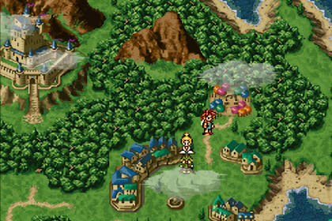

# Ejercicios de Funciones en Python

En esta sección practicarás creación y uso de funciones en Python, aplicadas a distintos contextos.

---

## 1) Jujutsu Kaisen (`jujutsu_kaisen.py`)


Debes simular un combate entre hechiceros del universo de Jujutsu Kaisen.

Cada hechicero se representa con un diccionario que contiene:
- `"nombre"`
- `"nivel"` (poder base de 1 a 10)
- `"tecnica"` (nombre de su técnica maldita)
- `"energia"` (puntos de energía disponibles)

Funciones a crear:

1. `mostrar_estado(hechicero)`
- Imprime nombre, nivel, técnica y energía actual.
- Se utiliza cada vez que se quiera revisar el estado de un personaje.

2. `atacar(atacante, defensor)`
- Resta energía al defensor según el nivel del atacante.
- Debe llamar a `validar_energia(defensor)` para verificar si puede seguir luchando.

3. `usar_tecnica(hechicero)`
- Reduce la energía del hechicero en 2 puntos.
- Debe llamar a `validar_energia(hechicero)` para comprobar si aún puede usar técnicas.

4. `validar_energia(hechicero)`
- Retorna `True` si la energía del hechicero es mayor a 0.
- Retorna `False` en caso contrario.
- Esta función debe reutilizarse para evitar repetir lógica.

5. `combate(hechicero1, hechicero2)`
- Controla el flujo del combate alternando ataques y uso de técnicas.
- Llama repetidamente a `atacar`, `usar_tecnica` y `mostrar_estado`.

Prueba tus funciones con:

```python
gojo = {"nombre": "Satoru Gojo", "nivel": 10, "tecnica": "Infinito", "energia": 20}
sukuna = {"nombre": "Sukuna", "nivel": 9, "tecnica": "Dominio Maldito", "energia": 20}

mostrar_estado(gojo)
mostrar_estado(sukuna)
atacar(gojo, sukuna)
usar_tecnica(sukuna)
combate(gojo, sukuna)
```

---

## 2) Matemáticas (`matematicas.py`)


Debes crear una pequeña librería de funciones matemáticas:

1. `sumar(x, y)`
- Retorna la suma.
- Si el resultado es mayor a 100, muestra: `"El resultado es demasiado grande"`.

2. `restar(x, y)`
- Retorna la resta.
- Si el resultado es menor a 0, muestra: `"El resultado es negativo"`.

3. `multiplicar(x, y)`
- Retorna la multiplicación.
- Si el resultado es mayor a 100, muestra: `"El resultado es demasiado grande"`.

4. `dividir(x, y)`
- Retorna la división con 2 decimales.
- Si `y == 0`, muestra: `"No se puede dividir por cero"`.

Prueba tus funciones con estas llamadas:

```python
sumar(3, 12)
restar(4, 9)
multiplicar(13, 9)
dividir(11, 5)
```

---

## 3) Saludos (`saludos.py`)


Debes crear una función llamada `saludar` que permita saludar a una persona.

Parámetros:
- `nombre` (obligatorio): nombre de la persona.
- `edad` (opcional): si se entrega, el saludo varía según la edad.
- `carrera` (opcional): si se entrega, se incluye en el saludo.

Reglas del saludo:
1. Siempre debe incluir: `"Hola {nombre}"`.
2. Si se entrega `edad`:
- Si es menor de 18: `"¡Qué joven eres con {edad} años!"`
- Si es 18 o más: `"Toda una experiencia con {edad} años."`
3. Si se entrega `carrera`, agregar:
- `"Estudias {carrera}, ¡mucho éxito!"`

Prueba tu función con:

```python
saludar("Pepe")
saludar("Juan", 21, "Informática")
```

---

## 4) Movimiento en Mapa RPG (`movimiento.py`)



Eres un personaje RPG en un mapa de **6x6** casillas.
Tu posición inicial es `(3, 3)` y puedes moverte con:
- `w`: arriba
- `s`: abajo
- `a`: izquierda
- `d`: derecha

Reglas:
1. No puedes salir de los límites del mapa (coordenadas válidas: `0` a `5`).
2. Cada movimiento debe mostrar el mapa actualizado con una `X` en la posición actual.
3. Si intentas salir del mapa, se muestra un mensaje de error y la posición no cambia.
4. El programa termina cuando el jugador elige salir.

Funciones sugeridas:

1. `validar_posicion(x, y)`
- Recibe coordenadas y retorna `True` si están dentro del rango permitido.
- Retorna `False` si están fuera del mapa.

2. `mover_derecha(posicion)`
- Intenta mover al jugador a la derecha.
- Debe llamar a `validar_posicion` antes de actualizar.

3. `mover_izquierda(posicion)`
- Igual que la anterior, pero hacia la izquierda.

4. `mover_arriba(posicion)`
- Igual que la anterior, pero hacia arriba.

5. `mover_abajo(posicion)`
- Igual que la anterior, pero hacia abajo.

6. `mostrar_mapa(posicion)`
- Imprime el mapa con una `x` en la posición actual.
- Ejemplo de salida:

```text
......
......
...x..
......
......
......
```

7. `menu()`
- Controla el flujo del juego.
- Recibe la tecla ingresada por el usuario y llama a la función correspondiente.
