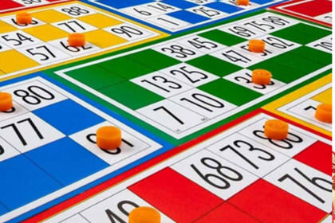

# Ejercicios

Esta carpeta contiene los ejercicios propuestos para practicar el uso de números aleatorios.

---

## Ejercicio 1 — Dados (`dados.py`)


Usted debe crear un programa que simule el lanzamiento de 3 dados. El programa debe:

1. Lanzar los 3 dados de forma aleatoria (valores del 1 al 6).
2. Calcular el resultado con la siguiente fórmula:

**resultado = (dado 1 × dado 2) − dado 3**

3. Mostrar el valor de cada dado y el resultado obtenido.
4. Clasificar el resultado según los siguientes criterios:

| Resultado      | Mensaje                |
|----------------|------------------------|
| Menor a 10     | "Resultado bajo"       |
| Entre 10 y 20  | "Resultado intermedio" |
| Mayor a 20     | "Resultado alto"       |

---

## Ejercicio 2 — Personajes (`personajes.py`)


Usted debe crear un programa que genere un personaje aleatorio para jugar Calabozos y Dragones. El programa debe:

1. Solicitar el **nombre** del personaje como parámetro de entrada.
2. Generar los siguientes atributos de forma aleatoria:

| Atributo      | Rango          |
|---------------|----------------|
| Ataque        | 10 a 40        |
| Defensa       | 5 a 20         |
| Inteligencia  | 0 a 30         |

3. Asignar clase, arma y hechizo según los atributos obtenidos:

| Condición                  | Efecto                              |
|----------------------------|-------------------------------------|
| Por defecto                | Clase: **Novato**, sin arma ni hechizo |
| Ataque mayor a 35          | Arma equipada: **Espada Excalibur** |
| Defensa mayor a 15         | Clase: **Paladín**                  |
| Inteligencia mayor a 20    | Hechizo: **Bola de Fuego**          |

4. Mostrar al final la ficha completa del personaje con todos sus datos.

---

## Ejercicio 3 — Acciones (`acciones.py`)


Usted debe crear un programa que genere aleatoriamente una acción para uno de los personajes. Los elementos disponibles son:

| Personajes | Verbos      | Lugares        |
|------------|-------------|----------------|
| Nina       | Estudiando  | La biblioteca  |
| Luna       | Cantando    | La cordillera  |
| Alis       | Bailando    | El patio       |
| Jack       | Saltando    | El lago        |
| Cris       |             | La sede        |

El programa debe seleccionar aleatoriamente un personaje, un verbo y un lugar, y mostrar el siguiente mensaje:

**[Personaje] está [verbo] en [lugar]**

Por ejemplo: `Nina está estudiando en la biblioteca`

---

## Ejercicio 4 — Lotería (`loteria.py`)



Usted debe crear un programa que genere un cartón de lotería. El programa debe:

1. Seleccionar **15 números al azar** del 1 al 30, **sin repetir**.
2. Mostrar los números ordenados en una grilla de **3 filas × 5 columnas**, con los números formateados con dos dígitos.

Ejemplo de salida:

```
05 06 09 11 12
13 15 17 18 19
20 21 22 27 29
```
